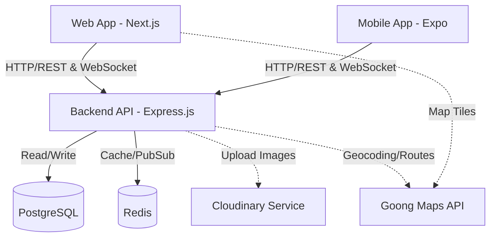
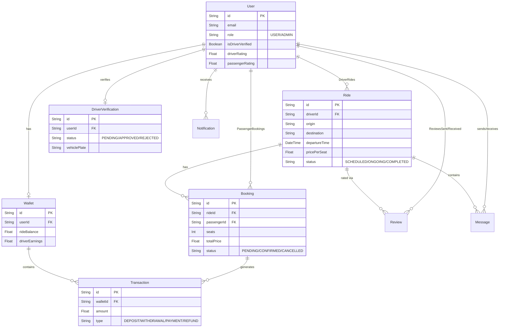

# 🚗 CoRide Project

CoRide là một nền tảng chia sẻ chuyến đi (Carpooling / Ride-hailing) đa nền tảng, kết nối tài xế có ghế trống với hành khách có cùng lộ trình, giúp tối ưu chi phí di chuyển và giảm thiểu ùn tắc giao thông.

## 🌟 Overview

*   **Mục tiêu dự án**: Xây dựng hệ thống gọi xe an toàn, tiện lợi với chi phí hợp lý thông qua mô hình chia sẻ chuyến đi.
*   **Bài toán giải quyết**: Giải quyết vấn đề trống ghế trên các chuyến đi cá nhân và nhu cầu di chuyển giá rẻ của hành khách.
*   **Đối tượng sử dụng**:
    *   **Tài xế (Driver)**: Người có xe cá nhân (ô tô, xe máy) muốn chia sẻ chi phí đi lại.
    *   **Hành khách (Passenger)**: Người có nhu cầu di chuyển với ngân sách tiết kiệm.
    *   **Quản trị viên (Admin)**: Người quản lý hệ thống, xét duyệt tài xế và giải quyết khiếu nại.

## ✨ Features

Dựa trên phân tích source code, hệ thống hiện có các tính năng cốt lõi:

*   **Authentication & Authorization**: Đăng nhập, đăng ký với JWT. Quản lý phân quyền (User/Admin).
*   **Tiered KYC**: Xét duyệt giấy tờ tài xế (Bằng lái, đăng ký xe).
*   **Ride Management**: Tài xế tạo chuyến đi (Origin, Destination, Giá, Số ghế). Hành khách tìm kiếm và đặt chuyến.
*   **Real-time Communication**: Nhắn tin trực tiếp giữa tài xế và hành khách, nhận thông báo hệ thống (Socket.io).
*   **Wallet & Payments**: Ví điện tử tích hợp, nạp/rút tiền, giữ tiền khi đặt chuyến (Ride Balance) và cộng tiền cho tài xế (Driver Earnings).
*   **Rating & Reviews**: Đánh giá 2 chiều tách biệt giữa tài xế và hành khách.
*   **Map & Routing**: Tích hợp bản đồ và tính toán lộ trình thông qua Goong Maps API.
*   **Media Upload**: Upload avatar và hình ảnh giấy tờ lên Cloudinary.

## 🛠 Tech Stack

Hệ thống được phát triển theo mô hình **Monorepo** quản lý bởi **Turborepo**.

| Category | Technology |
| :--- | :--- |
| **Frontend (Web)** | Next.js 14, React 18, Tailwind CSS, shadcn/ui, Leaflet, Goong JS |
| **Frontend (Mobile)** | React Native, Expo, NativeWind, Zustand, React Query |
| **Backend** | Node.js, Express.js, TypeScript, Socket.io |
| **Database** | PostgreSQL, Redis (Caching) |
| **ORM** | Prisma |
| **Cloud / 3rd Party** | Cloudinary (Image Storage), Goong Maps (Geocoding/Routing) |
| **DevOps** | Docker, Docker Compose, GitHub Actions |
| **Authentication** | JWT (jose, bcrypt) |

## 📂 Project Structure

```text
coride-monorepo/
├── apps/
│   ├── backend/        # REST API Server & WebSocket (Express.js, Socket.io)
│   ├── mobile/         # Ứng dụng di động (Expo, React Native)
│   └── web/            # Ứng dụng Web / Admin Dashboard (Next.js)
├── packages/
│   ├── database/       # Prisma Schema, Migrations & Database Client
│   └── shared/         # Common types, utils, UI components dùng chung
├── .github/            # Cấu hình CI/CD workflow
├── docker-compose.yml  # File cấu hình deploy các services
├── turbo.json          # Cấu hình Turborepo
└── package.json        # Workspace configuration
```

## 🏗 Architecture

Hệ thống đang sử dụng kiến trúc **Modular Monolith** kết hợp **Monorepo** cho mã nguồn.



## 🚀 Installation

### Prerequisites

*   Node.js (>= 20.x)
*   npm (v10.x)
*   Docker & Docker Compose

### Clone Repository

```bash
git clone <repository_url>
cd coride
```

### Install Dependencies

Chạy lệnh cài đặt ở thư mục gốc (Monorepo sẽ tự động cài cho toàn bộ apps và packages):

```bash
npm install
```

### Environment Setup

Tạo file `.env` từ `.env.example` ở thư mục gốc:

```bash
cp .env.example .env
```

### Database Migration

Khởi chạy PostgreSQL và Redis thông qua Docker:

```bash
docker-compose up -d postgres_db redis_cache
```

Chạy Prisma Migrations để tạo bảng:

```bash
npm run migrate --workspace=backend
```

*Hoặc có thể chạy lệnh sinh Prisma client:*
```bash
npm run generate --workspace=@repo/database
```

### Run Project

Khởi chạy toàn bộ dự án (Web, Backend) bằng Turborepo:

```bash
npm run dev
```

Chạy Mobile App cùng Backend và API Gateway (khuyến nghị):

```bash
npm run dev:mobile
```

Lệnh trên dùng launcher Node cục bộ để tự khởi động đồng thời Expo, Backend ở
cổng `5101` và API Gateway ở cổng `5001`, vì vậy không cần chạy thủ công
`node ./node_modules/tsx/dist/cli.mjs src/server.ts` nữa.

Nếu đang đứng trong thư mục `apps/mobile`, có thể dùng lệnh tương đương:

```bash
cd apps/mobile
npm run start
```

Chỉ chạy riêng Expo (chỉ dùng khi Backend và API Gateway đã chạy ở terminal khác):

```bash
cd apps/mobile
npm run start:expo
```

## ⚙️ Environment Variables

Các biến môi trường cấu hình tại file `.env` gốc (được cung cấp cho container qua Docker Compose):

| Variable | Description | Required |
| :--- | :--- | :--- |
| `DATABASE_URL` | Chuỗi kết nối PostgreSQL (Prisma) | Yes |
| `REDIS_URL` | Chuỗi kết nối Redis Cache | Yes |
| `JWT_SECRET` | Secret key để mã hóa / giải mã JSON Web Token | Yes |
| `PORT` | Port cho Backend API Server (Mặc định: 5001) | Yes |
| `NEXT_PUBLIC_GOONG_MAPTILES_KEY`| API Key Goong Maps dùng cho Frontend hiển thị bản đồ | Yes |
| `GOONG_REST_API_KEY` | API Key Goong Maps dùng cho Backend (Geocoding/Directions) | Yes |
| `CLOUDINARY_URL` | Chuỗi kết nối Cloudinary upload hình ảnh | Yes |
| `NEXT_PUBLIC_API_URL` | Đường dẫn gọi Backend từ Web Frontend | Yes |

## 🗄 Database Schema

Sơ đồ ERD (Entity Relationship Diagram) đại diện dựa trên `schema.prisma`.



## 🧪 Testing

Hệ thống có cấu hình test:
*   **Backend (Unit & Integration)**: Sử dụng `Jest` và `Supertest`.
    ```bash
    npm run test --workspace=backend
    ```
*   **Web (E2E Test)**: Sử dụng `Playwright`.
    ```bash
    npm run test --workspace=web
    ```

## 🛡 Security

Các biện pháp bảo mật hiện tại được triển khai trong source code:

*   **JWT (JSON Web Token)**: Xác thực Stateless cho APIs. Refresh token được quản lý trong database.
*   **Password Hashing**: Mã hóa mật khẩu bằng `bcrypt`.
*   **Rate Limiting**: Giới hạn số lượng request API sử dụng `express-rate-limit`.
*   **CORS**: Middleware chặn request chéo nguồn không hợp lệ.
*   **Helmet**: Bảo vệ HTTP headers bằng `helmet`.
*   **Input Validation**: Kiểm tra tính hợp lệ của dữ liệu đầu vào bằng `zod`.

## 📦 Build & Deployment

Hệ thống được thiết lập sẵn với Docker Compose.

### Docker Development
Khởi chạy toàn bộ services trong nền:

```bash
docker compose up -d
```

Source TypeScript được bind mount và tự reload; không cần rebuild khi chỉ sửa code.
Xem hướng dẫn đầy đủ tại [docs/docker-development.md](docs/docker-development.md).

### CI/CD
Dự án sử dụng GitHub Actions (cấu hình trong `.github`) để thiết lập luồng CI/CD, tự động lint, format và build khi có thay đổi trên repository.

## 📝 License
ISC (Theo cấu hình package.json)

## 👨‍💻 Author
**Not Found in Source Code**.
